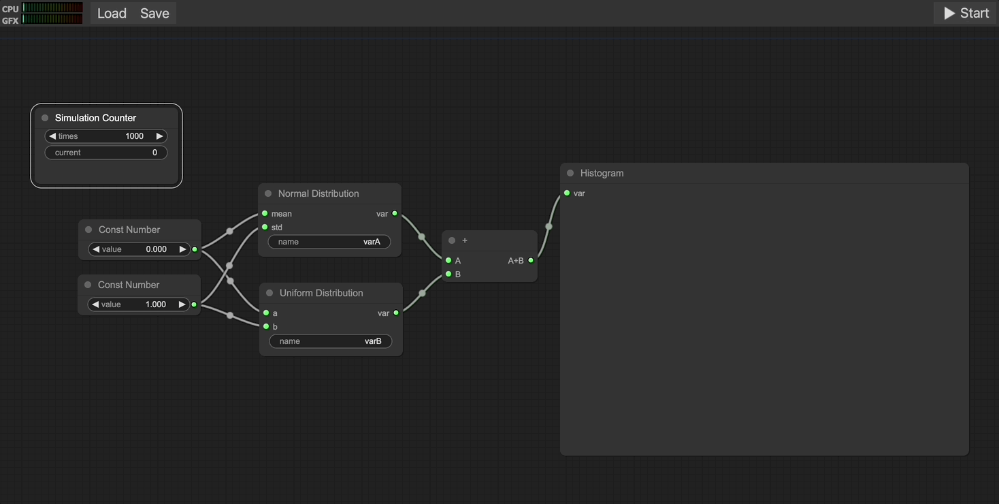

# Risk.js

A web application for Monte-Carlo modeling and simulation. [[Demo]](https://jezil.github.io/Risk.js)

**Dependencies**

- [Apache ECharts](https://github.com/apache/echarts)
- [ecStat](https://github.com/ecomfe/echarts-stat) [[Fork]](https://github.com/JeziL/echarts-stat)
- [jStat](https://github.com/jstat/jstat)
- [litegraph.js](https://github.com/jagenjo/litegraph.js)

*Project structure from [Frontend Boilerplates](https://github.com/CKGrafico/Frontend-Boilerplates).*
[*Favicon created by Pixelmeetup - Flaticon.*](https://www.flaticon.com/free-icons/graph)
