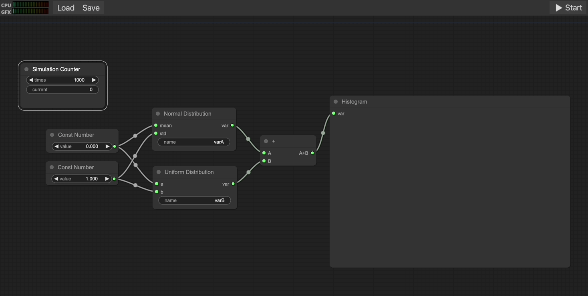

# Risk.js

A web application for Monte-Carlo modeling and simulation.

**Dependencies**

- [Apache ECharts](https://github.com/apache/echarts)
- [ecStat](https://github.com/ecomfe/echarts-stat)
- [jStat](https://github.com/jstat/jstat)
- [litegraph.js](https://github.com/jagenjo/litegraph.js)

[*Favicon created by Pixelmeetup - Flaticon*](https://www.flaticon.com/free-icons/graph)
